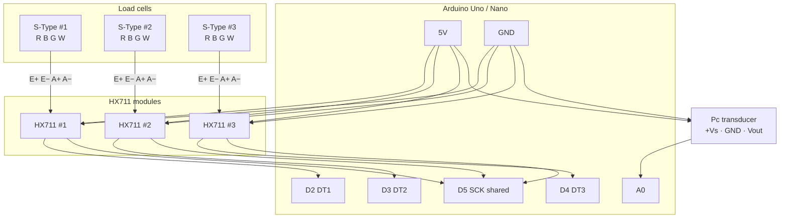

# Load Cell → Arduino DAQ (3× S-Type + HX711)

How to wire **three** S-type load cells through **three** HX711 amplifier boards into **one** Arduino so you can log thrust (and optional chamber pressure) during a static fire.

Related component list: [`Hybrid Motor Static Fire Project.md`](../Hybrid%20Motor%20Static%20Fire%20Project.md) §3.

---

## What each part does (start here if you are new to electronics)

Think of the chain like a bathroom scale → amp → computer:

| Part | What it is | What it does in plain language |
| ---- | ---------- | ------------------------------ |
| **Load cell** | Metal “S” sensor with 4 thin wires | When thrust pushes/pulls on it, the metal flexes a tiny amount and the electrical signal on the wires changes by a few millivolts (too small for an Arduino to read alone). |
| **HX711** | Small amplifier / ADC board | Makes that tiny signal bigger and turns it into a digital number the Arduino can understand. **You need one HX711 per load cell.** |
| **Arduino** | Small microcontroller board (Uno, Nano, etc.) | Reads the three HX711 boards over USB-serial and prints force vs time to a laptop. |
| **Pc transducer** (optional) | Pressure sensor on the chamber | Outputs a voltage (about 0.5–4.5 V) that represents chamber pressure; wire that voltage into Arduino pin **A0**. |
| **Laptop** | Your computer | Powers the Arduino over USB and records the CSV text the Arduino prints. |

**Important:** Do **not** wire a load cell’s signal wires straight into Arduino pins. The signal is far too small. Always go **load cell → HX711 → Arduino**.

---

## Overview diagram

Signal flow left → right: each load cell feeds its own HX711; all three HX711s share power and one clock pin on the Arduino; the optional pressure sensor goes to analog pin A0.



**How to read this diagram**

1. **Load cells** (top left) each have four colored wires: Red, Black, Green, White (often abbreviated R B G W).
2. Those four wires go to matching pads on **that cell’s HX711** (`E+`, `E−`, `A+`, `A−`).
3. Each HX711 sends its reading to the Arduino on a **separate** digital pin (`D2`, `D3`, `D4`) labeled **DT** (data out).
4. All three HX711 boards share **one** clock wire into Arduino **`D5`** (labeled **SCK**).
5. All boards also share **5V** (power) and **GND** (ground / common return).
6. The optional **Pc transducer** is separate: power from 5V/GND, signal into **`A0`**.

---

## Pin names in plain English

You will see short labels printed on the boards. Here is what they mean:

| Label on board | Full name | Beginner meaning |
| -------------- | --------- | ---------------- |
| **5V** | Five volts | Power supply from the Arduino. Like the “+” side of a battery for these sensors. |
| **GND** | Ground | Common return / “−” side. All GND pins must connect together. |
| **VCC** | Board power in | On the HX711, connect this to Arduino **5V**. |
| **E+** / **E−** | Excitation + / − | Power the load cell’s internal bridge. Usually **Red → E+**, **Black → E−**. |
| **A+** / **A−** | Analog signal + / − | The tiny force signal from the cell. Usually **Green → A+**, **White → A−**. |
| **DT** or **DOUT** | Data out | Digital reading from the HX711 to the Arduino (**one pin per HX711**). |
| **SCK** or **CLK** | Serial clock | Timing pulse from the Arduino. **One Arduino pin can feed all three HX711 SCK pads.** |
| **A0** | Analog input 0 | Arduino pin that measures a voltage (used for the pressure sensor). |
| **D2, D3, D4, D5** | Digital pins 2–5 | Arduino pins that talk to the HX711 boards (on/off digital signals, not the tiny load-cell millivolts). |

### Why three DT pins but only one SCK?

- **DT (data)** is unique to each HX711 — like three separate conversation lines so the Arduino knows *which* cell is speaking.
- **SCK (clock)** can be shared — the Arduino “knocks” on the same clock line and then listens on DT1, DT2, or DT3 in turn.

---

## Parts to buy (BOM)

| Qty | Item | Preferred buy link | Est. | Notes |
| --: | ---- | ------------------ | ---- | ----- |
| **3** | HX711 load-cell amp | **[SparkFun SEN-13879](https://www.sparkfun.com/sparkfun-load-cell-amplifier-hx711.html)** (~$4.95 ea) · [Amazon SparkFun](https://www.amazon.com/dp/B079LVMC6X) | ~$15–30 | Preferred. Alt: [Adafruit #5974](https://www.adafruit.com/product/5974) (~$9.95, screw terminals + 10/80 SPS switch). Budget: [DIYmall 2-pack](https://www.amazon.com/dp/B010FG9RXO) ×2 (=4 modules) |
| 3 | S-type load cell | **≥500 kg** each for hot fire | — | Cold-flow example only: [Bolisila 200 kg B0D2D5Z37T](https://www.amazon.com/Bolisila-Compression-Weighing-Transducer-Capacaity/dp/B0D2D5Z37T) |
| 1 | Arduino Uno / Nano | Any 5 V board with ≥6 free digital pins | — | Uno / Nano / Mega all fine |
| 1 | Pc transducer (optional) | [DATAQ 0–1500 psi, 1/4″ NPT](https://www.dataq.com/products/accessories/pressure-sensor/2000361-hs-1500.html) | ~$79 | 0.5–4.5 V → Arduino `A0` |
| — | DuPont jumper wires and/or screw-terminal wire, USB cable | — | — | Prefer screw terminals at the HX711 if the stand vibrates |

**Software library (install once in Arduino IDE):** [bogde/HX711](https://github.com/bogde/HX711) — Library Manager → search “HX711 Arduino Library” by Bogdan Necula → Install.

---

## Recommended pin map (copy this when wiring)

| Module | Load cell | HX711 DT → Arduino | HX711 SCK → Arduino |
| ------ | --------- | ------------------ | ------------------- |
| LC1 | Cell 1 | **D2** | **D5** (shared with the others) |
| LC2 | Cell 2 | **D3** | **D5** |
| LC3 | Cell 3 | **D4** | **D5** |
| — | Pc transducer signal (`Vout`) | — | **A0** |

Also connect:

- Every HX711 **VCC** → Arduino **5V**
- Every HX711 **GND** → Arduino **GND**
- Every load-cell cable **shield** (bare metal / foil drain) → Arduino **GND** (Arduino end only)

```text
  Cell1 ──► HX711 #1 ── DT ──► D2 ─┐
                                   │
  Cell2 ──► HX711 #2 ── DT ──► D3 ─┼── Arduino
                                   │
  Cell3 ──► HX711 #3 ── DT ──► D4 ─┘
                 │
                 └── SCK ──────────► D5   (one wire to all three SCK pins)

  All HX711 VCC → 5V
  All HX711 GND → GND
  Cable shields → GND (Arduino end only)
```

---

## Step-by-step: wire one load cell (then repeat ×3)

Do **cell 1 + HX711 #1** completely first. When numbers look sane on the serial monitor, copy the same pattern for cells 2 and 3.

1. **Identify the four wires** on the load cell. Typical Chinese S-type colors (always check the label on *your* cable):
   - Red = excitation +
   - Black = excitation −
   - Green = signal +
   - White = signal −
2. **Screw or solder** those four wires onto HX711 #1:
   - Red → **E+**
   - Black → **E−**
   - Green → **A+**
   - White → **A−**
3. **Power the HX711:** jumper **VCC → Arduino 5V**, **GND → Arduino GND**.
4. **Data wires:** HX711 **DT → D2**, HX711 **SCK → D5**.
5. Plug the Arduino into the laptop with USB. Upload the example sketch below (even with only one cell connected, you can comment out the other two reads while testing).
6. Repeat for HX711 #2 (DT → **D3**, same **D5** for SCK) and HX711 #3 (DT → **D4**, same **D5**).

**RATE / sample speed:** for a burn you want **80 samples per second**. On SparkFun boards, solder the RATE jumper; on Adafruit, slide the switch to 80 SPS; on cheap clones, connect the RATE pad to VCC if it is not already.

---

## Per-cell wire colors (typical)

Confirm colors on the **cable label** that ships with your cells — colors are not a universal law.

| Load-cell wire | Typical color | HX711 pad |
| -------------- | ------------- | --------- |
| Excitation + | Red | **E+** |
| Excitation − | Black | **E−** |
| Signal + | Green | **A+** |
| Signal − | White | **A−** |
| Shield | Bare / foil | Arduino **GND** |

The HX711 provides about **4.3 V** on E+/E− when the board is powered from 5 V. That is compatible with the Bolisila-class **5–15 V** excitation range (rated output **2.0 mV/V**, bridge about **350 Ω**).

---

## Detailed circuit diagram (all three cells)

Same connections as the overview diagram, drawn pin-by-pin:

```text
 LOAD CELL 1              LOAD CELL 2              LOAD CELL 3
 (S-type)                 (S-type)                 (S-type)
 Red  Black Green White   Red  Black Green White   Red  Black Green White
  │     │     │     │      │     │     │     │      │     │     │     │
  ▼     ▼     ▼     ▼      ▼     ▼     ▼     ▼      ▼     ▼     ▼     ▼
┌───────────────────┐   ┌───────────────────┐   ┌───────────────────┐
│     HX711 #1      │   │     HX711 #2      │   │     HX711 #3      │
│                   │   │                   │   │                   │
│  E+ ← Red         │   │  E+ ← Red         │   │  E+ ← Red         │
│  E− ← Black       │   │  E− ← Black       │   │  E− ← Black       │
│  A+ ← Green       │   │  A+ ← Green       │   │  A+ ← Green       │
│  A− ← White       │   │  A− ← White       │   │  A− ← White       │
│                   │   │                   │   │                   │
│  VCC              │   │  VCC              │   │  VCC              │
│  GND              │   │  GND              │   │  GND              │
│  DT               │   │  DT               │   │  DT               │
│  SCK              │   │  SCK              │   │  SCK              │
└─┬───┬───┬───┬─────┘   └─┬───┬───┬───┬─────┘   └─┬───┬───┬───┬─────┘
  │   │   │   │           │   │   │   │           │   │   │   │
  │   │   │   └───────────┼───┼───┼───┴───────────┼───┼───┼───┘
  │   │   │               │   │   │               │   │   │
  │   │   └───────────────┼───┼───┘               │   │   │
  │   └───────────────────┼───┘                   │   │   │
  └───────────────────────┼───────────────────────┘   │   │
                          │                           │   │
                     ┌────▼───────────────────────────▼───▼──┐
                     │           ARDUINO UNO / NANO          │
                     │                                       │
                     │   5V  ◄── all HX711 VCC + Pc +Vs      │
                     │   GND ◄── all HX711 GND + Pc GND      │
                     │        + load-cell cable shields      │
                     │                                       │
                     │   D2  ◄── HX711 #1 DT                 │
                     │   D3  ◄── HX711 #2 DT                 │
                     │   D4  ◄── HX711 #3 DT                 │
                     │   D5  ◄── HX711 #1/#2/#3 SCK (tied)   │
                     │                                       │
                     │   A0  ◄── Pc transducer Vout          │
                     │                                       │
                     │   USB ──► laptop (power + CSV log)    │
                     └───────────────────────────────────────┘


   DATAQ Pc TRANSDUCER (optional)
   ┌────────────────────────────┐
   │  +Vs  (often red)   ──► 5V │
   │  GND  (often black) ──► GND│
   │  Vout (often white) ──► A0 │
   └────────────────────────────┘
```

### Master connection checklist

| From | Wire / pad | To |
| ---- | ---------- | -- |
| Cell 1, 2, or 3 | Red → **E+**, Black → **E−**, Green → **A+**, White → **A−** | That cell’s HX711 |
| Cell cable shields | Bare / foil | Arduino **GND** |
| HX711 #1, #2, #3 | **VCC** | Arduino **5V** |
| HX711 #1, #2, #3 | **GND** | Arduino **GND** |
| HX711 #1 | **DT** | Arduino **D2** |
| HX711 #2 | **DT** | Arduino **D3** |
| HX711 #3 | **DT** | Arduino **D4** |
| HX711 #1, #2, and #3 | **SCK** (all three pads tied together) | Arduino **D5** |
| Pc transducer | **Vout** | Arduino **A0** |
| Pc transducer | **+Vs** / **GND** | Arduino **5V** / **GND** |

---

## Why three HX711 boards (not one)?

One HX711 chip has two input channels (A and B), but channel B is a weaker/different gain and is awkward for a third equal-quality cell. Using **three identical modules** means:

- Each cell gets a full-strength Channel-A reading.
- Calibration stays simple (one scale factor per cell).
- If one amp fails, the other two still work.

### Total thrust in software

If all three cells share the axial thrust path (three parallel load paths into the thrust bulkhead):

\[
F_{\mathrm{total}} = F_1 + F_2 + F_3
\]

Calibrate each cell on its own, then **add** the three forces in software. Always log F1, F2, and F3 separately so you can spot binding or uneven loading.

---

## Example sketch (3 scales + optional Pc)

```cpp
#include "HX711.h"

HX711 lc1, lc2, lc3;

const int SCK_PIN = 5;
const int DT1 = 2, DT2 = 3, DT3 = 4;

// Replace after known-weight calibration (raw counts per kg)
float cal1 = 1.0f, cal2 = 1.0f, cal3 = 1.0f;

void setup() {
  Serial.begin(115200);

  lc1.begin(DT1, SCK_PIN);
  lc2.begin(DT2, SCK_PIN);
  lc3.begin(DT3, SCK_PIN);

  lc1.set_scale(cal1);
  lc2.set_scale(cal2);
  lc3.set_scale(cal3);

  // Zero with motor mounted, no thrust (stand ready, MAIN closed)
  lc1.tare();
  lc2.tare();
  lc3.tare();

  Serial.println("t_ms,F1_N,F2_N,F3_N,Fsum_N,Pc_psi");
}

void loop() {
  float kg1 = lc1.get_units(1);
  float kg2 = lc2.get_units(1);
  float kg3 = lc3.get_units(1);

  float N1 = kg1 * 9.80665f;
  float N2 = kg2 * 9.80665f;
  float N3 = kg3 * 9.80665f;
  float Nsum = N1 + N2 + N3;

  float Vpc = analogRead(A0) * (5.0f / 1023.0f);
  // DATAQ-class 0.5–4.5 V → 0–1500 psi (confirm your sensor curve)
  float psi = (Vpc - 0.5f) * (1500.0f / 4.0f);

  Serial.print(millis()); Serial.print(',');
  Serial.print(N1, 2);    Serial.print(',');
  Serial.print(N2, 2);    Serial.print(',');
  Serial.print(N3, 2);    Serial.print(',');
  Serial.print(Nsum, 2);  Serial.print(',');
  Serial.println(psi, 1);

  // Loop rate limited by three sequential HX711 reads (~80 SPS each → ~25 Hz sum)
}
```

### How fast does this sample?

HX711 at 80 SPS with **three sequential reads** → roughly **~20–25 Hz** for the summed thrust channel. That is enough for overall impulse and burn shape, not for high-frequency acoustics. Keep this path for Phase 0; upgrade later only if you need simultaneous multi-kHz sampling.

---

## Calibration checklist

1. Mount cells in the **final** thrust path (same polarity as hot fire).
2. Power Arduino + three HX711s; open Serial Monitor at **115200** baud.
3. With no thrust load (stand ready), run `tare()` for each channel (already in `setup()` above).
4. Apply a **known mass / force** through the thrust axis (hang weights or a jack + reference gauge).
5. Adjust each `cal1` / `cal2` / `cal3` until `get_units()` matches the known kg on that cell.
6. Verify `Fsum ≈` the known total when the load is shared across all three.
7. Log a dry “tap test” and confirm CSV columns before any N₂O.

If a channel reads **negative** under compression (thrust into the cell), either swap **A+/A−** (Green/White) on that HX711 or multiply that channel by **−1** in software.

---

## Power & stand practice

- Three bridges draw on the order of **~40 mA** plus a few mA for the chips — USB 5 V from the laptop is fine for DAQ.
- Keep **GSE / igniter / solenoid** power on a **separate battery**. Keep sensor wiring physically away from the high-current MAIN coil cable.
- Ground cable shields at the **Arduino end only** (avoids ground loops).
- Capacity reminder: project target is **≥500 kg per cell** before hot fire. 200 kg cells are for cold-flow and learning the wiring only.

---

## Quick links

| Resource | URL |
| -------- | --- |
| SparkFun HX711 (order **3**) | https://www.sparkfun.com/sparkfun-load-cell-amplifier-hx711.html |
| Adafruit HX711 | https://www.adafruit.com/product/5974 |
| Amazon SparkFun HX711 | https://www.amazon.com/dp/B079LVMC6X |
| Budget DIYmall 2-pack (buy ×2) | https://www.amazon.com/dp/B010FG9RXO |
| bogde HX711 library | https://github.com/bogde/HX711 |
| HX711 datasheet (Avia) | https://cdn.sparkfun.com/datasheets/Sensors/ForceFlex/hx711_english.pdf |
| Example cold-flow cell (200 kg) | https://www.amazon.com/Bolisila-Compression-Weighing-Transducer-Capacaity/dp/B0D2D5Z37T |
